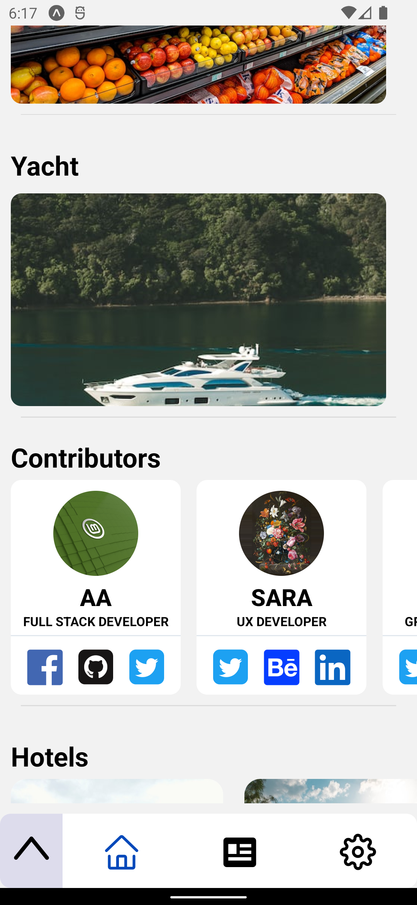

### Hi there 👋, my name is Ahmed

#### I am Mobile App Developer

Skills: React Native, Type script, Redux, Animations, PHP Laravel, Firebase, MySQL, Postgres, Rest API

- Time management experience
- PMP (product management professional) knowledge.
- Experience with GIT source control.

# About Me:

- I’m currently learning Supabase. 
- I’m looking to collaborate on full stack : laravel-react native 
- I’m looking for help with UI/UX 
- Ask me about React Native, Redux and typescript 

### 📧 AHMED_5G@YAHOO.COM

       

# Review my React Native portfolio application v0.8

</a>

- For android devices download Expo Go application https://expo.dev/client

- For IOS devices, maybe later.

- Scan QR

</a>

- or past link:
  exp://u.expo.dev/update/086e8b61-8371-46d5-a7cb-dda0edb16b61

- more details about project :
  https://github.com/AHMED-5G/portfolio

something went wrong or right ? please let me know.

## 🌐 Socials:

- 
